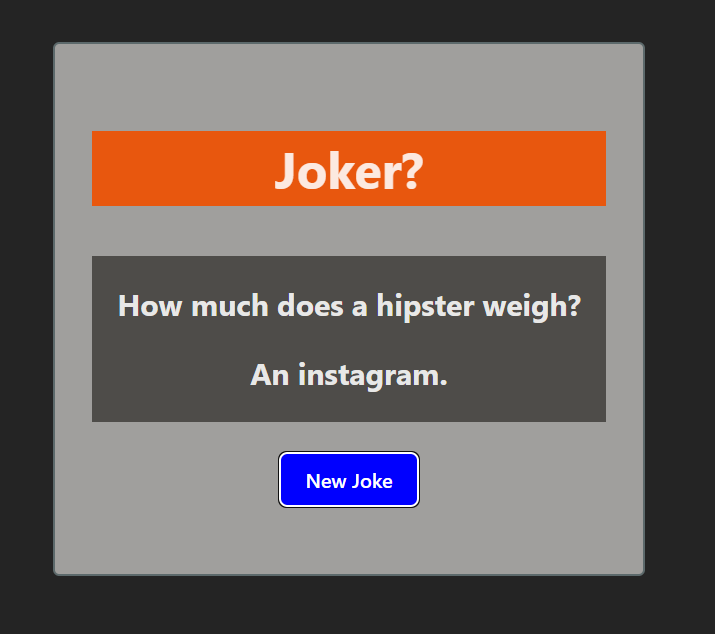

# Joke Generator 🤣

A simple **React-based Joke Generator** that fetches random jokes from an API and displays them on the page.  
Click the button to get a new joke instantly!

## 🚀 Features
- Fetches random jokes using a public API.
- Updates dynamically without page reload.
- Clean and responsive design.
- Built with **React + Vite**.

## 🛠️ Technologies Used
- **React** (Frontend framework)
- **Vite** (Fast build tool)
- **CSS** (Styling)
- **Fetch API** (Data fetching)

## 📦 Installation & Setup

1. **Clone the repository**
   ```bash
   git clone https://github.com/shivamkumar214/joke-generator.git
Navigate to the project folder

bash
Copy
Edit
cd joke-generator
Install dependencies

bash
Copy
Edit
npm install
Run the development server

bash
Copy
Edit
npm run dev
Open your browser at the link provided in the terminal (usually http://localhost:5173).

🖼️ Screenshot



🔗 API Used
Official Joke API

📜 License
This project is licensed under the MIT License.
